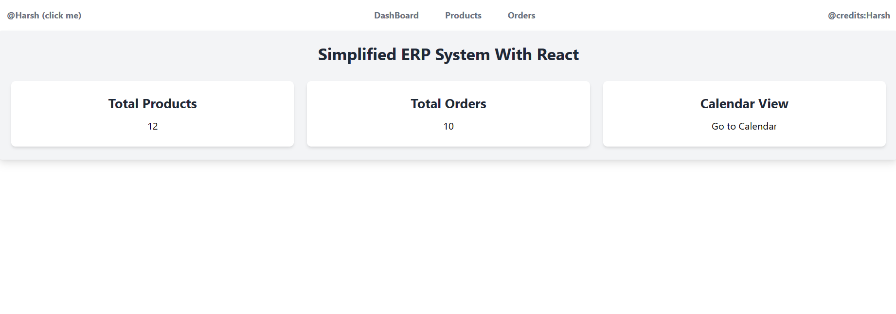
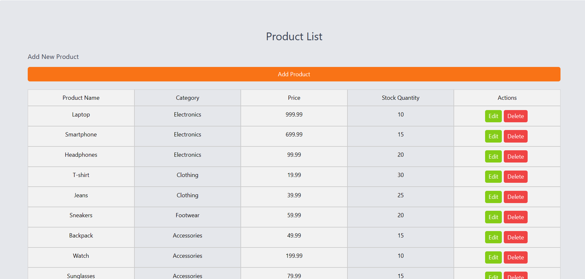
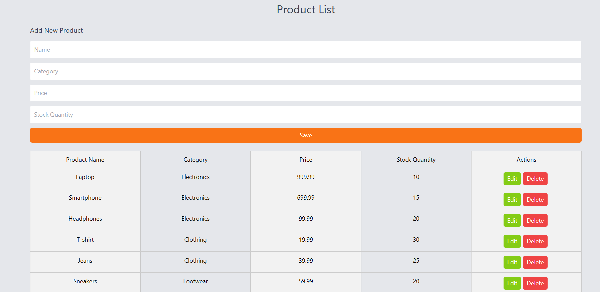
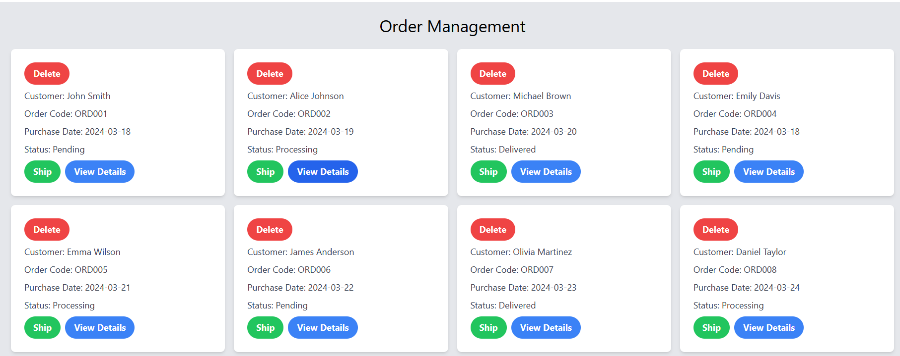
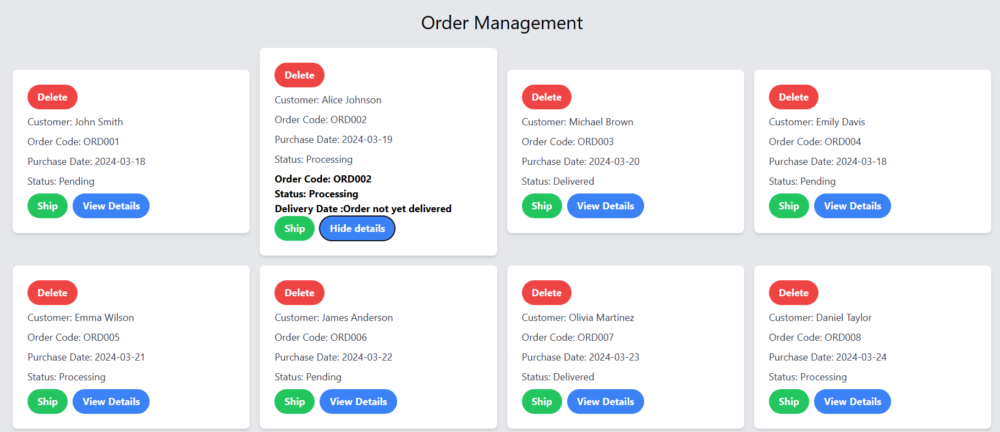
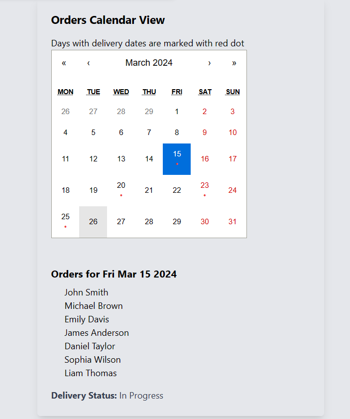

# User Guide for Simple ERP System with React

Welcome to the documentation for our simplified ERP system built with React. This guide will walk you through the steps to run the application on your local machine.

## Getting Started

### Clone the Repository

Begin by cloning the repository to your local environment. Use the following command:

```bash
git clone https://github.com/HarsHvardhnn/Entnt-erp.git
```

### Navigate to the Project Directory

Once cloned, navigate to the project directory:

```bash
cd ENTNT-erp
```

### Install Dependencies

Before running the application, you'll need to install the necessary dependencies. You can do this using npm or yarn. Here's the command:

```bash
npm install
```

or

```bash
yarn install
```

### Run the Application

Now that you have the dependencies installed, you can start the development server. Execute the following command:

```bash
npm start
```

or

```bash
yarn start
```

### Access the Application

Once the server is up and running, you can access the application by opening your web browser and navigating to [http://localhost:3000](http://localhost:3000).

Enjoy exploring our ERP system! If you have any questions or encounter any issues, feel free to reach out to our support team.


###FEATURES
 
NAVBAR  
We can navigate through each page seamlessly using this navbar 


HOME PAGE

Welcome to the Home/Dashboard page!

This page serves as the central hub for your ERP system, providing you with an overview of essential information. Here, you can conveniently access key metrics such as the total number of products and orders.

Additionally, from this page, you have the option to seamlessly navigate to the calendar view. The calendar view offers a comprehensive visual representation of your orders, allowing you to track delivery dates and manage your schedule effectively.

 

PRODUCTS PAGE 


The product list view displays comprehensive details including product name, category, price, and current stock quantity. It provides a succinct overview of all available products, allowing users to quickly assess essential information at a glance. With this concise presentation, users can efficiently manage inventory, track stock levels, and make informed decisions regarding product management and restocking.




In addition to viewing the total list of products with detailed information such as product name, category, price, and stock quantity, users have the functionality to perform various actions. By clicking on the "Add Product" button, users can seamlessly add new products to the list. Furthermore, the interface allows for easy editing of existing products through the "Edit" button, enabling users to modify product details as needed. Additionally, users can swiftly remove products from the list by utilizing the "Delete" button, providing comprehensive control over product management tasks within the application.




Welcome to the Order page, your central hub for managing all orders and accessing their details. Here, you can conveniently view a comprehensive list of all orders placed within the system. Whether you need to track order statuses, review delivery dates, or access specific order details, this page provides a streamlined interface for efficient order management. Explore the intuitive layout to quickly locate and navigate through orders, ensuring smooth operations and enhanced productivity in handling your business transactions.




In addition to viewing all orders, you have the option to explore further details by clicking on the "Show Details" button. This functionality allows you to delve deeper into individual orders, providing access to comprehensive information such as order status, delivery dates.




On this calendar, you have the ability to check orders based on specific dates. Dates highlighted with a red dot signify scheduled deliveries for those particular dates. This visual cue makes it easy to identify days with impending deliveries, allowing for efficient planning and coordination of logistics. By utilizing the calendar's functionality, you can seamlessly navigate through dates and stay informed about upcoming deliveries, ensuring timely and organized order fulfillment.




